# Frontend Toolkit (aptx-ft) 架构文档

## 项目概述

Frontend Toolkit 是一个基于 Rust 后端 + TypeScript CLI 的代码生成工具，用于根据 OpenAPI/Swagger 3.x 规范生成前端 API 客户端、TypeScript 类型定义和各种框架相关的代码。

**技术栈**：
- Rust (核心代码生成引擎)
- TypeScript + Node.js (CLI 界面)
- N-API (Rust ↔ Node.js 跨语言绑定)
- pnpm (包管理器)

---

## 整体架构

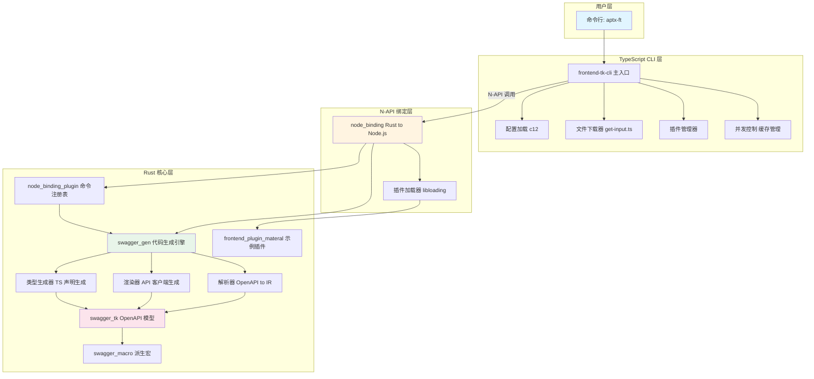

---

## Rust Crate 依赖关系

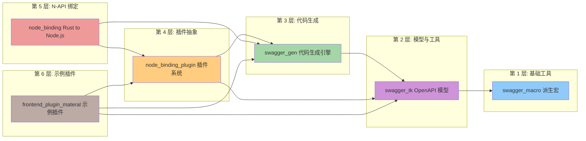

### 详细依赖说明

| Crate | 职责 | 外部依赖 | 被依赖 |
|--------|------|----------|---------|
| **swagger_macro** | Rust 过程宏，提供派生能力 | `quote`, `syn` | swagger_tk |
| **swagger_tk** | OpenAPI 3.x 完整模型定义 | `swagger_macro`, `serde`, `serde_json` | swagger_gen, node_binding_plugin, frontend_plugin_materal |
| **swagger_gen** | 代码生成核心引擎 | `swagger_tk`, `Inflector`, `dprint-*`, `regex` | node_binding_plugin, node_binding, frontend_plugin_materal |
| **node_binding_plugin** | 插件系统接口定义 | `swagger_gen`, `swagger_tk` | node_binding, frontend_plugin_materal |
| **node_binding** | N-API 绑定层 | `napi`, `napi-derive`, `libloading`, `node_binding_plugin`, `swagger_gen`, `swagger_tk`, `frontend_plugin_materal` | frontend-tk-cli |
| **frontend_plugin_materal** | 示例插件 | `node_binding_plugin`, `swagger_gen`, `swagger_tk` | - |

---

## TypeScript Package 依赖关系

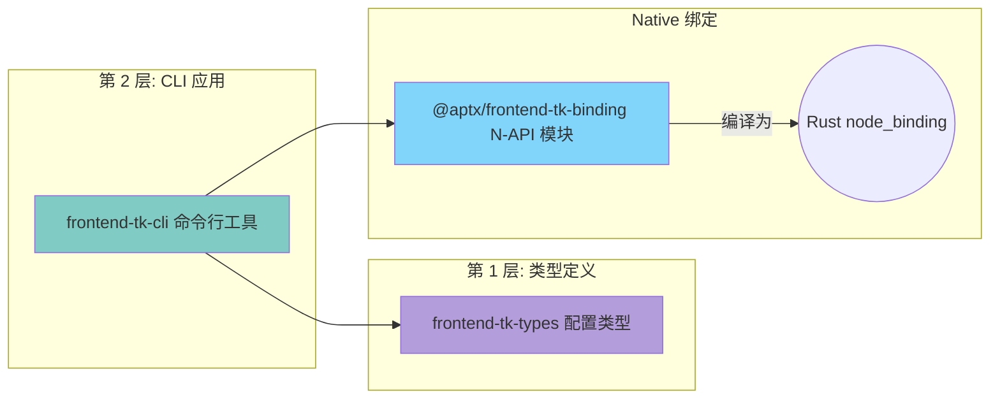

### Package 详细说明

| Package | 职责 | 外部依赖 |
|---------|------|----------|
| **frontend-tk-types** | 配置文件类型定义<br/>`defineConfig()` 辅助函数 | - |
| **frontend-tk-cli** | 用户 CLI 界面<br/>命令解析、配置加载、文件下载<br/>插件管理、并发控制 | `@aptx/frontend-tk-binding`, `c12`, `chalk`, `commander` |
| **@aptx/frontend-tk-binding** | N-API 绑定模块<br/>编译为跨平台 .node 二进制 | `napi`, `napi-derive`, `libloading` |

---

## 模块结构详解

### swagger_tk - OpenAPI 模型层

```
swagger_tk/src/
├── model/                          # OpenAPI 3.x 完整类型定义
│   ├── open_api_object.rs          # 顶层 OpenAPI 对象
│   ├── operation_object.rs         # 操作对象
│   ├── path_item_object.rs         # 路径项对象
│   ├── response_object.rs          # 响应对象
│   ├── request_body_object.rs      # 请求体对象
│   ├── parameter_object.rs        # 参数对象
│   ├── media_type_object.rs        # 媒体类型
│   ├── schema/                    # Schema 类型系统
│   │   ├── mod.rs
│   │   ├── schema_enum.rs       # Schema 枚举类型
│   │   ├── schema_object.rs     # 对象类型
│   │   ├── schema_array.rs      # 数组类型
│   │   ├── schema_string.rs     # 字符串类型
│   │   ├── schema_integer.rs    # 整数类型
│   │   ├── schema_number.rs     # 数字类型
│   │   └── schema_bool.rs      # 布尔类型
│   └── ... (300+ 个文件)
├── extension/                      # 模型扩展方法
│   ├── schema_enum.rs            # Schema → TS 类型转换
│   ├── media_type_object.rs      # 媒体类型扩展
│   └── response_value.rs       # 响应值扩展
└── getter/                        # 查询工具
    ├── get_schema_by_name.rs    # 通过名称获取 Schema
    ├── get_schema_name_from_ref.rs  # 从 $ref 解析名称
    ├── get_tags.rs              # 获取 tags
    └── get_controller_description.rs  # 获取控制器描述
```

**核心功能**：
- 解析 OpenAPI 3.x JSON/YAML
- 提供类型安全的 Rust 模型
- Schema 到 TypeScript 类型转换 (`get_ts_type()`)
- 查询辅助方法

---

### swagger_gen - 代码生成引擎

```
swagger_gen/src/
├── core/                          # API 上下文构建
│   ├── js_helper.rs              # API 上下文主结构
│   └── js_api_context_helper.rs  # 上下文辅助方法
├── gen_api/                       # API 客户端生成器
│   ├── mod.rs
│   ├── axios_ts.rs               # Axios + TypeScript
│   ├── axios_js.rs               # Axios + JavaScript
│   └── uni_app.rs               # UniApp 框架
├── gen_declaration/                # TypeScript 类型生成
│   ├── declaration.rs            # 类型声明生成
│   └── index.ts                # 导出生成
├── pipeline/                       # 代码生成流水线
│   ├── parser.rs                 # OpenAPI → IR 转换
│   └── model.rs                 # 中间表示定义
├── utils/                         # 工具函数
│   ├── format_ts_code.rs         # 代码格式化 (dprint)
│   ├── schema_extension.rs       # Schema → TS 类型扩展
│   └── reference_object_extension.rs  # 引用对象扩展
└── lib.rs                        # 库入口
```

**核心功能**：
- 解析 OpenAPI 到中间表示 (IR)
- 生成多种框架的 API 客户端
- 生成 TypeScript 类型声明
- 代码格式化与美化

---

### node_binding - N-API 绑定层

```
node_binding/src/
├── lib.rs                         # N-API 入口，暴露函数
│   ├── run_cli()                 # 执行 CLI 命令
│   └── get_help_tree()          # 获取帮助树
├── bootstrap.rs                   # 命令工厂初始化
│   └── init_command_factory()    # 加载插件并初始化
├── built_in/                      # 内置命令
│   ├── mod.rs                   # 命令注册入口
│   ├── ir.rs                   # ir:snapshot 命令
│   └── terminal_codegen.rs      # terminal:codegen 命令
└── package.json                   # N-API 配置
    ├── targets                  # 支持的平台列表
    └── binaryName               # 二进制名称
```

**暴露的 N-API 函数**：

```typescript
// packages/frontend-tk-cli/src/index.ts
import { runCli, getHelpTree } from "@aptx/frontend-tk-binding";

// 执行命令
runCli({
  input: string,           // OpenAPI 文件路径
  command: string,        // 命令名称
  plugin?: string[],      // 插件路径列表
  options: string[]       // 命令选项
})

// 获取帮助树
getHelpTree({ plugin?: string[] })
  → HelpCommandDescriptor[]
```

---

### frontend-tk-cli - CLI 应用层

```
frontend-tk-cli/src/
├── index.ts                       # 主入口，命令路由
├── config.ts                      # 配置加载 (c12)
├── command/
│   ├── input/
│   │   └── get-input.ts        # OpenAPI 文件下载/读取
│   └── gen/                    # 代码生成流程
└── utils.ts                       # 工具函数

bin/aptx.js                       # 可执行入口
dist/                             # 编译输出
types/                            # 类型声明
```

**支持的命令**：

| 命令 | 功能 |
|------|------|
| `codegen run` | 执行代码生成 |
| `codegen list-terminals` | 列出内置终端 |
| `doctor` | 检查环境状态 |
| `plugin list` | 列出加载的插件 |

---

## 完整调用链流程

### 主流程：代码生成

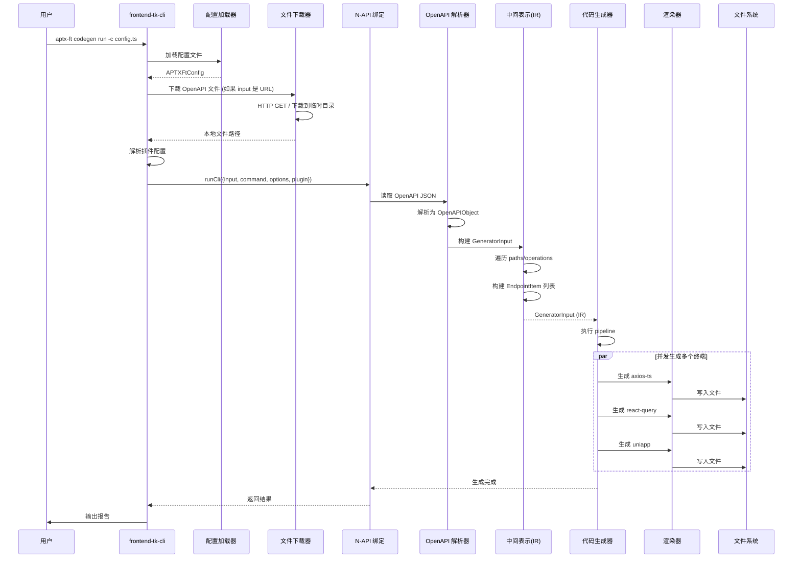

---

### 子流程：OpenAPI 解析

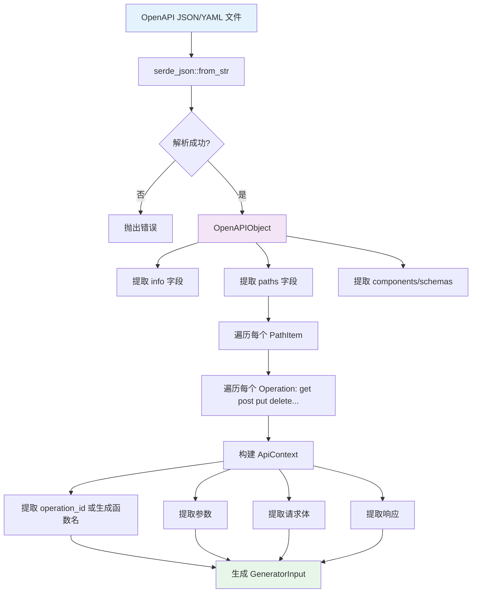

---

### 子流程：代码生成流水线


---

### 子流程：插件系统

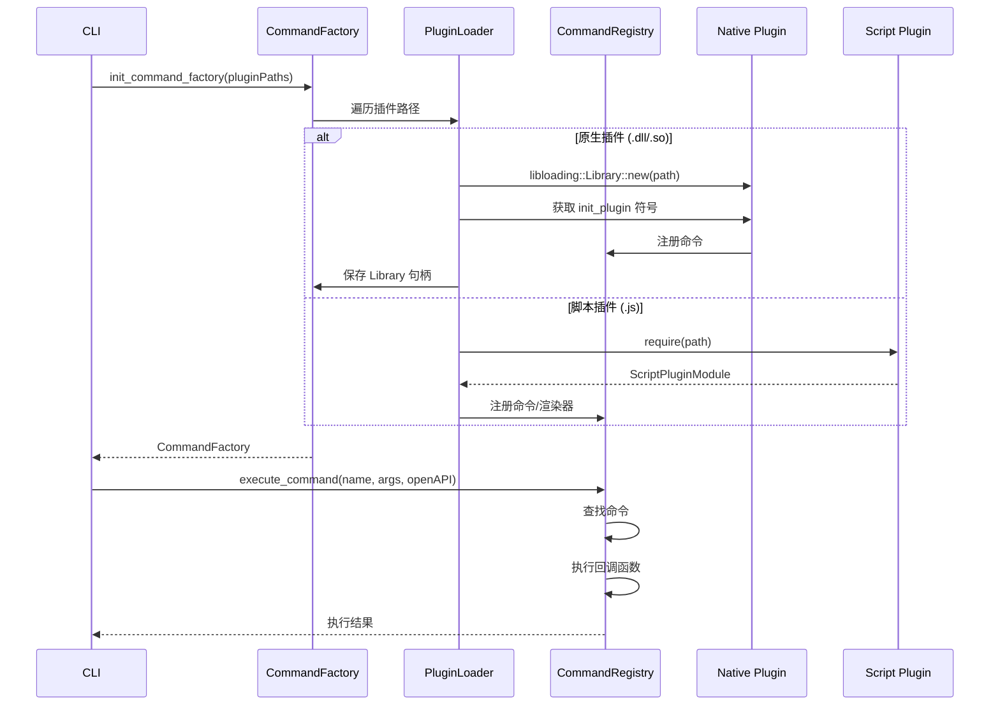

---

### 子流程：Schema 到 TypeScript 类型转换

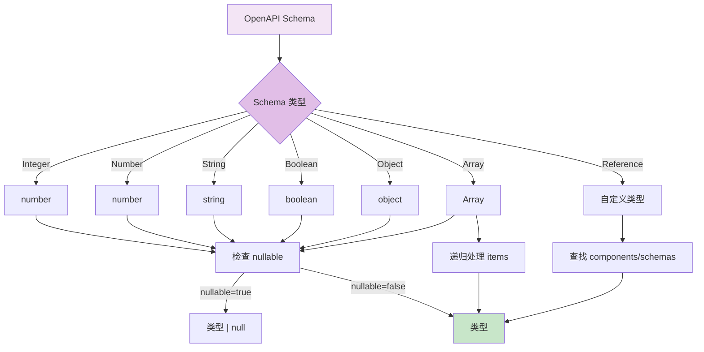

**实现代码** (`swagger_gen/src/utils/schema_extension.rs`):

```rust
fn get_ts_type(&self) -> String {
    match self {
        SchemaEnum::Ref(schema) => schema.get_type_name(),
        SchemaEnum::Object(_) => "object".to_string(),
        SchemaEnum::String(_) => "string".to_string(),
        SchemaEnum::Integer(_) => "number".to_string(),
        SchemaEnum::Number(_) => "number".to_string(),
        SchemaEnum::Boolean(_) => "boolean".to_string(),
        SchemaEnum::Array(schema) => {
            let child_type = schema.items.as_ref().get_ts_type();
            format!("Array<{}>", child_type)
        }
    }
}
```

---

## 数据结构

### GeneratorInput (中间表示)

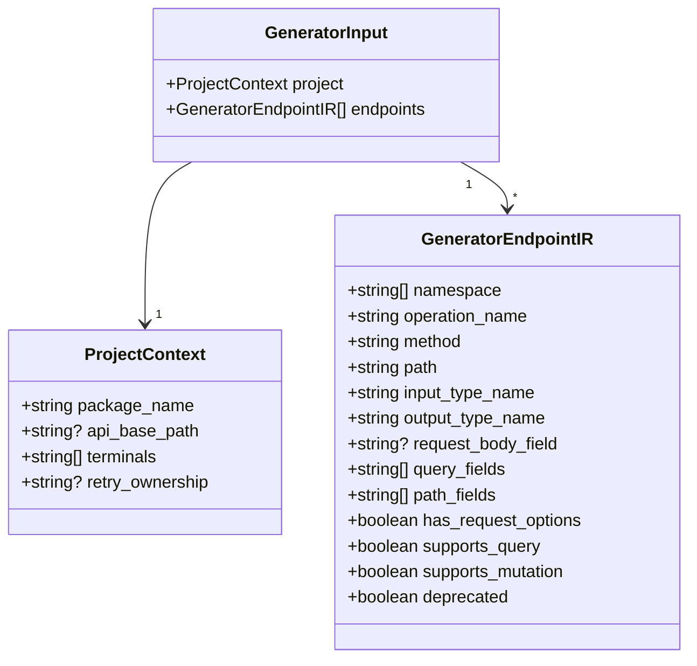

---

### CommandRegistry (命令注册表)

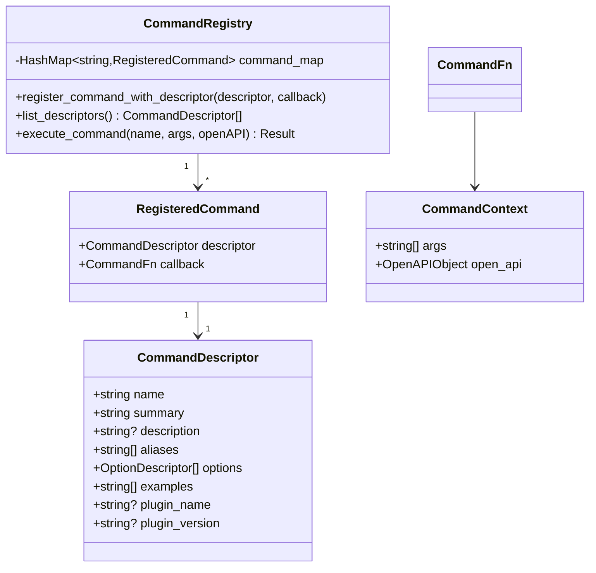

---

## 配置流程

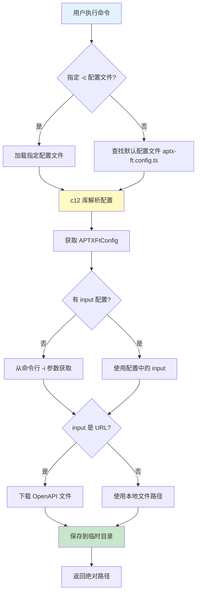

---

## 并发与缓存机制

### 并发执行

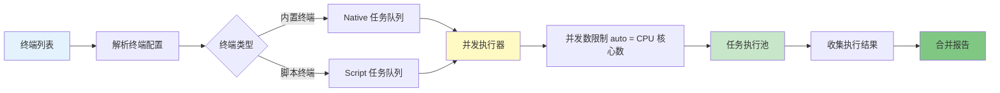

### 缓存机制

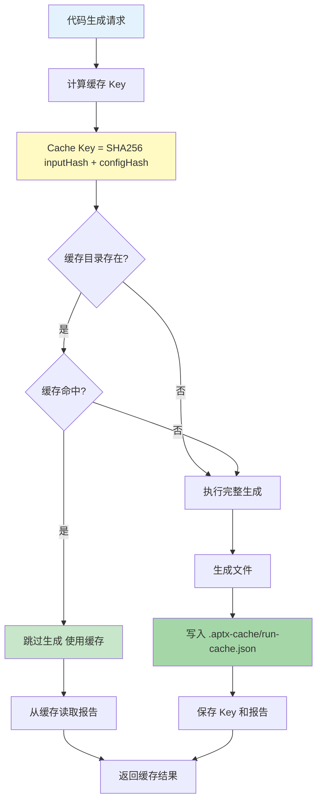

---

## 插件开发指南

### 原生插件开发

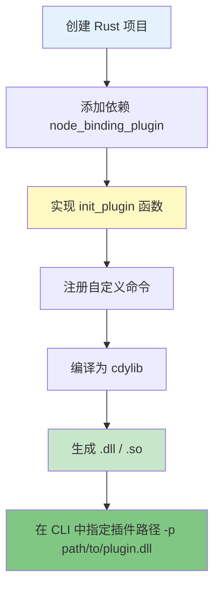

**示例代码**：

```rust
use aptx_frontend_tk_binding_plugin::command::{CommandDescriptor, CommandRegistry, OptionDescriptor};

#[no_mangle]
pub extern "C" fn init_plugin(registry: &CommandRegistry) {
    registry.register_command_with_descriptor(
        CommandDescriptor {
            name: "my-command".to_string(),
            summary: "我的自定义命令".to_string(),
            description: Some("这是一个示例命令".to_string()),
            aliases: vec![],
            options: vec![],
            examples: vec![],
            plugin_name: Some("my-plugin".to_string()),
            plugin_version: Some("1.0.0".to_string()),
        },
        Box::new(|args, open_api| {
            // 命令执行逻辑
            println!("执行我的命令: {:?}", args);
        }),
    );
}
```

### 脚本插件开发

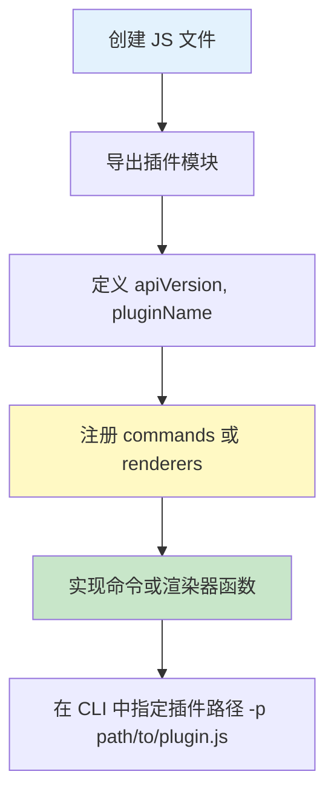

**示例代码**：

```typescript
module.exports = {
  apiVersion: "1",
  pluginName: "my-script-plugin",
  pluginVersion: "1.0.0",

  commands: [{
    name: "hello",
    summary: "打招呼",
    description: "向用户打招呼",
    options: [{
      long: "name",
      short: "n",
      value_name: "name",
      required: false,
      description: "用户名"
    }],
    examples: ["aptx-ft hello --name World"],
    run: ({ args, input, config, getIrSnapshot }) => {
      const name = args.includes("--name")
        ? args[args.indexOf("--name") + 1]
        : "User";
      console.log(`Hello, ${name}!`);
    }
  }],

  renderers: [{
    id: "custom-terminal",
    render: ({ input, ir, terminal, outputRoot, config, writeFile, writeFiles }) => {
      // 自定义渲染逻辑
      writeFile("custom.js", "// Custom code");
    }
  }]
};
```

---

## 支持的终端

| 终端 ID | 描述 | 生成代码类型 |
|---------|------|------------|
| **axios-ts** | Axios TypeScript 客户端 | `return this.get<T>(url, config)` |
| **axios-js** | Axios JavaScript 客户端 | `return axios.request({...})` |
| **uniapp** | UniApp 框架支持 | `return uni.request({...})` |
| **functions** | 纯函数导出 | `export function apiName(...)` |
| **react-query** | React Query Hooks | `const useApiName = (...)` |
| **vue-query** | Vue Query Composables | `const useApiName = (...)` |

---

## 构建与开发

### Rust 部分

```bash
# 构建 Rust workspace
cargo build --release

# 运行测试
cargo test

# 运行基准测试
cargo bench

# 构建 N-API 绑定
cd crates/node_binding
cargo build --release
napi build --platform --release
```

### TypeScript 部分

```bash
# 安装依赖
pnpm install

# 构建 TypeScript
cd packages/frontend-tk-cli
pnpm run build

# 构建 packages
pnpm -r run build
```

---

## 故障排查

### 常见问题

1. **N-API 模块加载失败**
   - 检查 Node.js 版本 (>= 10)
   - 重新编译 `@aptx/frontend-tk-binding`
   - 确认平台匹配

2. **OpenAPI 解析失败**
   - 验证 OpenAPI 格式
   - 检查 JSON 语法
   - 使用在线工具验证

3. **插件加载失败**
   - 检查插件路径是否正确
   - 原生插件：确认编译为 cdylib
   - 脚本插件：检查 CommonJS 导出格式

---

## 许可证

ISC
