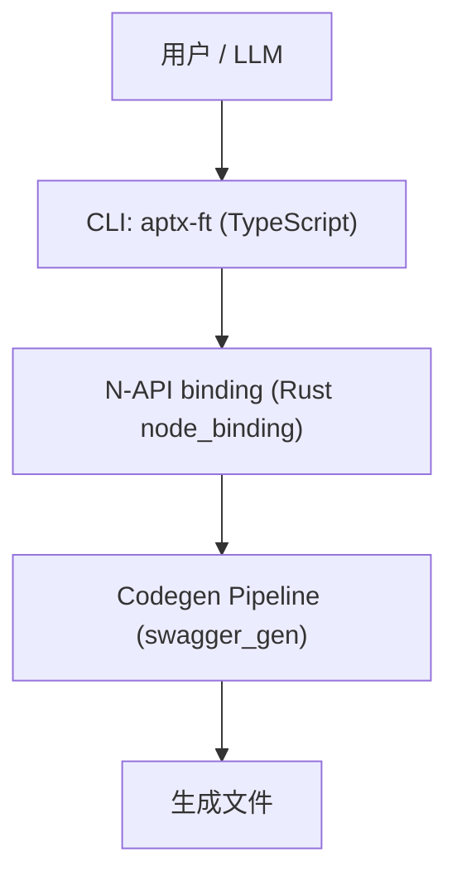
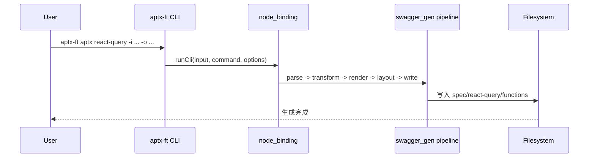

# Frontend Toolkit (aptx-ft) 架构文档

状态：Active  
日期：2026-02-14  
适用仓库：`frontend_tk_rs`

---

## 1. 系统总览

`frontend_tk_rs` 是一个 OpenAPI 代码生成器，采用 Rust 核心 + Node CLI 的分层结构。

核心目标：
- OpenAPI -> 统一 IR -> 多终端渲染
- 参数驱动，不依赖复杂配置
- 输出稳定且可预测

---

## 2. 分层职责

## 2.1 TypeScript CLI 层（`packages/frontend-tk-cli`）

职责：
- 命令解析与参数透传
- URL 输入下载（`input download`）
- 调用 `@aptx/frontend-tk-binding`

当前入口：
- `packages/frontend-tk-cli/bin/aptx.js`
- `packages/frontend-tk-cli/src/index.ts`

注意：
- `codegen run` 已删除，不再注册 `codegen` 命名空间。

## 2.2 N-API 绑定层（`crates/node_binding`）

职责：
- 将 CLI 命令映射到 Rust 内部生成能力
- 注册 built-in 命令
- 负责插件加载和命令分发

## 2.3 生成引擎层（`crates/swagger_gen` / `crates/swagger_gen_aptx`）

职责：
- 解析 OpenAPI 到 IR
- 渲染 `functions` / `react-query` / `vue-query` / model 等产物
- 路径计算、类型导入、layout、writer

关键规则：
- 生成 import 路径必须动态计算，禁止硬编码层级
- model 导入支持 `relative` 和 `package`
- 统一使用 `/` 路径分隔

扩展机制：
- **TransformPass**：管道中的扩展点，用于自定义 IR 变换
- 详见 [transform-pass-extension.md](./transform-pass-extension.md)

---

## 3. 当前命令面

以 `aptx-ft --help` 为准，当前可用命令：

- `aptx functions`
- `aptx react-query`
- `aptx vue-query`
- `model gen`
- `model ir`
- `model enum-plan`
- `model enum-apply`
- `materal enum-patch`
- `materal enum-plan`
- `materal enum-apply`
- `input download`

---

## 4. 生成目录规范（当前）

以 `-o <output-root>` 为基准：

- `spec/{namespace}/{operation}.ts`
- `functions/{namespace}/{operation}.ts`
- `react-query/{namespace}/{operation}.query.ts|mutation.ts`
- `vue-query/{namespace}/{operation}.query.ts|mutation.ts`
- 自动生成 `index.ts` re-export（多目录）

说明：
- 已完成扁平化，不再使用历史结构 `spec/endpoints/*` 与 `functions/api/*`。

---

## 5. 导入策略

## 5.1 model 导入

- `--model-mode relative`：
  - 将 `--model-path` 解析为绝对路径
  - 按“当前生成文件目录 -> 模型目录”计算相对导入
- `--model-mode package`：
  - 按包名导入（如 `@org/models`）

## 5.2 endpoint/spec 互引

- 由统一路径工具计算
- 不允许模板内写死 `../../spec/...` 深度

---

## 6. 关键工作流

---

## 7. 构建与验证基线

对 `frontend_tk_rs` 的代码改动，验证顺序：

1. 在仓库根执行 `pnpm build`
2. 用 `packages/frontend-tk-cli/bin/aptx.js` 跑真实命令
3. 检查关键生成文件与 import 路径

排障提示：
- `aptx.js` 启用 compile cache；若行为疑似未更新，先用 `NODE_DISABLE_COMPILE_CACHE=1` 复测。

---

## 8. 演进原则

- 早期阶段允许激进演进，不强行保留历史兼容分支
- 新增 terminal 时复用统一路径/导入工具
- 优先减少调用方参数负担，避免“每个命令都要手传易漏参数”
