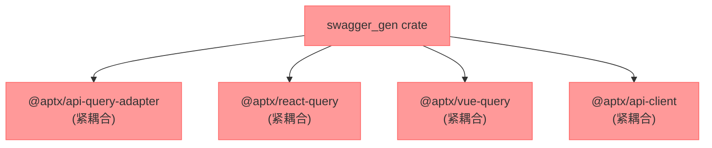
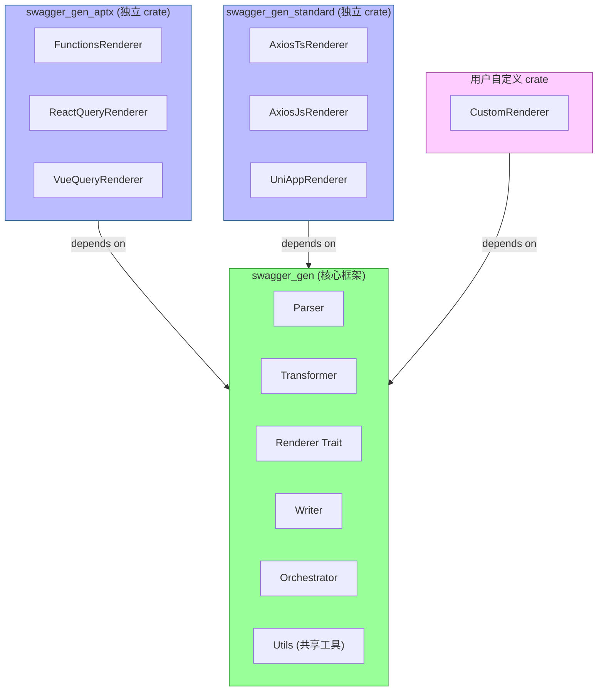
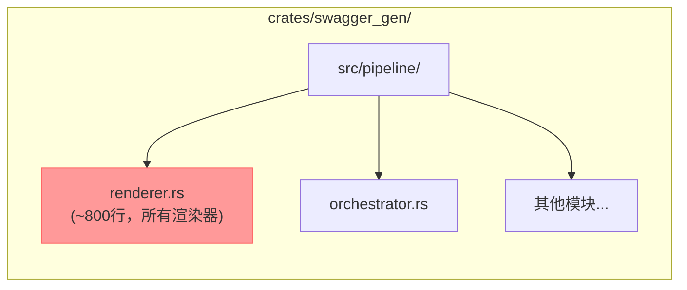
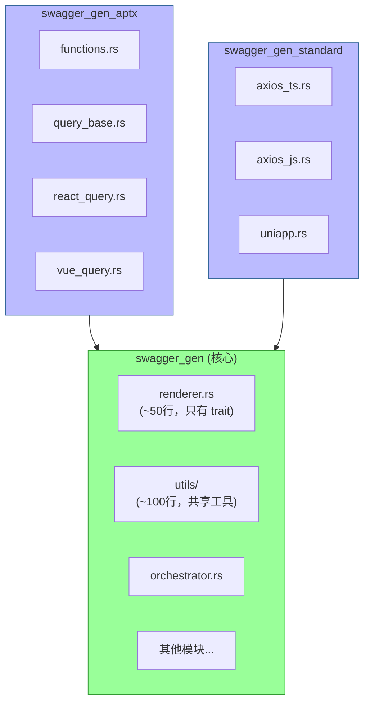
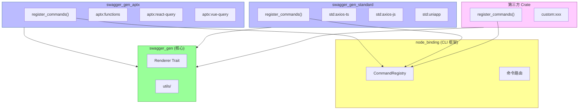
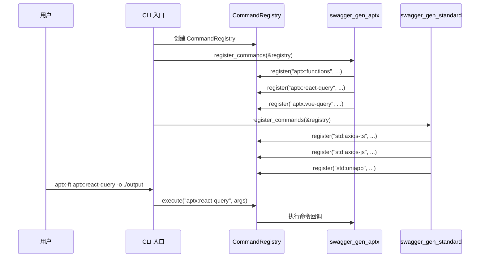
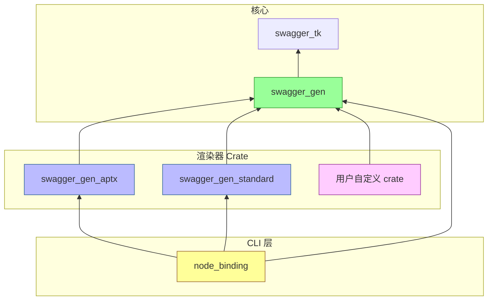

# 代码生成器架构迁移文档

## 1. 概述

### 1.1 迁移目标

**核心纯净化**：将代码生成器核心与 `@aptx` 包引用完全解耦，通过独立 crate 架构实现框架纯净，使核心代码生成器不依赖任何特定的业务包。

### 1.2 当前问题

在 `renderer.rs` 中存在以下硬编码的 `@aptx` 引用：

| 位置 | 引用 | 说明 |
|------|------|------|
| L361, L393 | `@aptx/api-query-adapter` | Query/Mutation 定义 |
| L361, L393 | `@aptx/react-query`, `@aptx/vue-query` | Hook 工厂函数 |
| L453, L460, L480 | `@aptx/api-client` | API 客户端和类型 |

这些硬编码违反了核心纯净化原则，使得代码生成器无法在不依赖 `@aptx` 包的情况下运行。

### 1.3 解决方案

**独立 Crate 架构**：将渲染器分离到独立的 crate 中，核心框架只保留抽象接口和通用工具。

---

## 2. 当前架构问题

### 2.1 硬编码的 @aptx 引用

**位置**：`crates/swagger_gen/src/pipeline/renderer.rs`

```rust
// 第 334-372 行：render_query_file 函数
format!(
    "import {{ createQueryDefinition }} from \"@aptx/api-query-adapter\";\n\
     import {{ {hook_factory} }} from \"@aptx/{terminal_package}\";\n\
     ...
```

### 2.2 渲染器分类

| 渲染器 | 依赖包 | 类型 |
|--------|--------|------|
| `FunctionsRenderer` | @aptx/api-client | @aptx 专用 |
| `ReactQueryRenderer` | @aptx/api-query-adapter, @aptx/react-query | @aptx 专用 |
| `VueQueryRenderer` | @aptx/api-query-adapter, @aptx/vue-query | @aptx 专用 |
| `AxiosTsRenderer` | tsyringe, axios | 标准通用 |
| `AxiosJsRenderer` | axios | 标准通用 |
| `UniAppRenderer` | tsyringe | 标准通用 |

### 2.3 耦合度分析



### 2.4 影响

1. **框架不纯净**：核心 crate 包含业务特定代码
2. **灵活性受限**：无法切换到其他 API 客户端或 Query 库
3. **测试困难**：核心功能测试必须依赖 `@aptx` 包
4. **扩展性差**：添加新的终端类型需要修改核心代码

---

## 3. 目标架构

### 3.1 独立 Crate 架构图



### 3.2 Crate 职责划分

| Crate | 职责 | 依赖 |
|-------|------|------|
| `swagger_gen` | 核心框架、接口定义、通用工具 | 无业务依赖 |
| `swagger_gen_aptx` | @aptx 专用渲染器 | swagger_gen |
| `swagger_gen_standard` | 标准通用渲染器 | swagger_gen |

### 3.3 架构优势

| 优势 | 说明 |
|------|------|
| **框架纯净** | swagger_gen 核心不依赖任何特定业务包 |
| **独立演进** | @aptx 适配可以独立版本迭代，不影响核心 |
| **可选依赖** | 用户只需引入需要的渲染器 crate |
| **清晰边界** | 核心框架和业务适配的职责明确分离 |
| **易于扩展** | 第三方可以基于公开接口开发自己的渲染器 |

---

## 4. 核心接口设计

### 4.1 Renderer Trait (保留在核心)

```rust
// swagger_gen/src/pipeline/renderer.rs

/// 渲染器核心 Trait
///
/// 所有渲染器（无论在哪个 crate）都必须实现此接口
pub trait Renderer: Send + Sync {
    /// 渲染器唯一标识符
    fn id(&self) -> &'static str;

    /// 渲染生成代码
    fn render(&self, input: &GeneratorInput) -> Result<RenderOutput, String>;
}
```

### 4.2 核心类型导出

```rust
// swagger_gen/src/lib.rs

pub mod pipeline {
    // === 核心接口 ===
    pub use self::renderer::Renderer;

    // === 数据模型 ===
    pub use self::model::{
        ClientImportConfig,      // 客户端导入配置
        EndpointItem,            // 端点信息
        ExecutionPlan,           // 执行计划
        GeneratorInput,          // 生成器输入
        ModelImportConfig,       // 模型导入配置
        PlannedFile,             // 计划文件
        ProjectContext,          // 项目上下文
        RenderOutput,            // 渲染输出
    };

    // === Pipeline 组件 ===
    pub use self::parser::{Parser, OpenApiParser};
    pub use self::transform::TransformPass;
    pub use self::layout::LayoutStrategy;
    pub use self::writer::Writer;
    pub use self::orchestrator::CodegenPipeline;
}

// === 共享工具函数 ===
pub mod utils {
    pub use self::type_utils::{
        normalize_type_ref,
        is_identifier_type,
        is_primitive_type,
        render_type_import_block,
        render_type_import_line,
    };
    pub use self::import_utils::{
        get_model_import_base,
        should_use_package_import,
    };
}
```

### 4.3 共享工具模块

```rust
// swagger_gen/src/pipeline/utils/type_utils.rs

/// 标准化类型引用
pub fn normalize_type_ref(type_name: &str) -> String {
    let trimmed = type_name.trim();
    if is_primitive_type(trimmed) || is_identifier_type(trimmed) {
        return trimmed.to_string();
    }
    "unknown".to_string()
}

/// 检查是否为标识符类型
pub fn is_identifier_type(type_name: &str) -> bool {
    let mut chars = type_name.chars();
    let first = chars.next();
    first.is_some_and(|ch| ch.is_ascii_alphabetic() || ch == '_')
        && chars.all(|ch| ch.is_ascii_alphanumeric() || ch == '_')
}

/// 检查是否为原始类型
pub fn is_primitive_type(type_name: &str) -> bool {
    matches!(
        type_name,
        "string" | "number" | "boolean" | "void" | "object" | "unknown"
    )
}

/// 渲染类型导入块
pub fn render_type_import_block(
    type_names: &[&str],
    base_import_path: &str,
    use_package: bool
) -> String {
    // ... 实现
}
```

---

## 5. 独立 Crate 实现

### 5.1 swagger_gen_aptx

**Cargo.toml**:

```toml
[package]
name = "swagger_gen_aptx"
version = "0.1.0"
edition = "2021"
description = "@aptx specific renderers for swagger_gen"

[dependencies]
swagger_gen = { path = "../swagger_gen" }
Inflector = "0.11.4"
```

**目录结构**:

```
swagger_gen_aptx/
├── Cargo.toml
└── src/
    ├── lib.rs
    ├── functions.rs      # FunctionsRenderer
    ├── query_base.rs     # React/Vue Query 共享逻辑
    ├── react_query.rs    # ReactQueryRenderer
    └── vue_query.rs      # VueQueryRenderer
```

**lib.rs**:

```rust
//! @aptx 专用渲染器
//!
//! 提供与 @aptx 包集成的渲染器实现

pub use swagger_gen::pipeline::{Renderer, GeneratorInput, RenderOutput, EndpointItem};
pub use swagger_gen::utils::{normalize_type_ref, render_type_import_block, ...};

mod functions;
mod query_base;
mod react_query;
mod vue_query;

pub use functions::AptxFunctionsRenderer;
pub use react_query::AptxReactQueryRenderer;
pub use vue_query::AptxVueQueryRenderer;
```

**react_query.rs**:

```rust
use swagger_gen::pipeline::{Renderer, GeneratorInput, RenderOutput, PlannedFile};
use swagger_gen::utils::{normalize_type_ref, render_type_import_block, ...};

/// @aptx React Query 渲染器
///
/// 生成使用 @aptx/react-query 的 React Query Hooks
pub struct AptxReactQueryRenderer;

impl Renderer for AptxReactQueryRenderer {
    fn id(&self) -> &'static str {
        "aptx-react-query"
    }

    fn render(&self, input: &GeneratorInput) -> Result<RenderOutput, String> {
        // 使用 @aptx 包的完整实现
        // 可以自由引用 @aptx/api-query-adapter, @aptx/react-query 等
        render_query_terminal(input, QueryTerminal::React)
    }
}
```

### 5.2 swagger_gen_standard

**Cargo.toml**:

```toml
[package]
name = "swagger_gen_standard"
version = "0.1.0"
edition = "2021"
description = "Standard renderers for swagger_gen"

[dependencies]
swagger_gen = { path = "../swagger_gen" }
Inflector = "0.11.4"
```

**目录结构**:

```
swagger_gen_standard/
├── Cargo.toml
└── src/
    ├── lib.rs
    ├── axios_ts.rs    # AxiosTsRenderer
    ├── axios_js.rs    # AxiosJsRenderer
    └── uniapp.rs      # UniAppRenderer
```

**lib.rs**:

```rust
//! 标准通用渲染器
//!
//! 提供不依赖特定业务包的通用渲染器实现

pub use swagger_gen::pipeline::{Renderer, GeneratorInput, RenderOutput};
pub use swagger_gen::utils::{normalize_type_ref, ...};

mod axios_ts;
mod axios_js;
mod uniapp;

pub use axios_ts::AxiosTsRenderer;
pub use axios_js::AxiosJsRenderer;
pub use uniapp::UniAppRenderer;
```

---

## 6. 迁移步骤

### 步骤 1：提取共享工具到核心

**目标**：将渲染器共享的工具函数提取到 swagger_gen 核心

**新增文件**：`crates/swagger_gen/src/pipeline/utils/`

```
utils/
├── mod.rs
├── type_utils.rs      # normalize_type_ref, is_identifier_type, is_primitive_type
└── import_utils.rs    # get_model_import_base, should_use_package_import
```

**修改**：`swagger_gen/src/lib.rs` 添加 utils 模块导出

### 步骤 2：创建 swagger_gen_aptx crate

**目标**：创建独立 crate 并迁移 @aptx 专用渲染器

**操作**：
1. 创建 `crates/swagger_gen_aptx/` 目录结构
2. 迁移 `FunctionsRenderer`, `ReactQueryRenderer`, `VueQueryRenderer`
3. 迁移相关私有函数（`render_query_terminal`, `render_query_file` 等）
4. 更新使用 `swagger_gen::utils` 中的共享函数

### 步骤 3：创建 swagger_gen_standard crate

**目标**：创建独立 crate 并迁移标准渲染器

**操作**：
1. 创建 `crates/swagger_gen_standard/` 目录结构
2. 迁移 `AxiosTsRenderer`, `AxiosJsRenderer`, `UniAppRenderer`
3. 迁移相关私有函数

### 步骤 4：重构核心 orchestrator

**目标**：支持外部渲染器注入

**修改**：`crates/swagger_gen/src/pipeline/orchestrator.rs`

```rust
impl CodegenPipeline {
    /// 添加渲染器
    pub fn with_renderer(mut self, renderer: Box<dyn Renderer>) -> Self {
        self.renderers.push(renderer);
        self
    }

    /// 添加多个渲染器
    pub fn with_renderers(mut self, renderers: Vec<Box<dyn Renderer>>) -> Self {
        self.renderers.extend(renderers);
        self
    }
}
```

### 步骤 5：更新 Cargo Workspace

**修改**：`Cargo.toml` (workspace 根)

```toml
[workspace]
members = [
    "crates/swagger_tk",
    "crates/swagger_gen",
    "crates/swagger_gen_aptx",      # 新增
    "crates/swagger_gen_standard",  # 新增
    # ...
]
```

### 步骤 6：测试验证

| 测试项 | 描述 | 预期结果 |
|--------|------|----------|
| 核心纯净 | swagger_gen 不含 @aptx 引用 | 编译通过，无业务依赖 |
| 渲染器迁移 | 使用新 crate 渲染器 | 输出与迁移前一致 |
| 组合使用 | 同时使用多个 crate | 正确生成所有代码 |
| 向后兼容 | 旧 API 继续工作 | 现有代码无需修改 |

---

## 7. 向后兼容策略

### 7.1 保留现有 Renderer Trait

```rust
// swagger_gen/src/pipeline/renderer.rs
// Renderer trait 保持不变，确保现有代码兼容

pub trait Renderer: Send + Sync {
    fn id(&self) -> &'static str;
    fn render(&self, input: &GeneratorInput) -> Result<RenderOutput, String>;
}
```

### 7.2 预设工厂方法 (可选保留)

```rust
// 如果需要保持现有 API，可以在 swagger_gen 中提供 re-export

// swagger_gen/src/lib.rs
#[cfg(feature = "aptx")]
pub use swagger_gen_aptx::{
    AptxFunctionsRenderer,
    AptxReactQueryRenderer,
    AptxVueQueryRenderer,
};

#[cfg(feature = "standard")]
pub use swagger_gen_standard::{
    AxiosTsRenderer,
    AxiosJsRenderer,
    UniAppRenderer,
};
```

### 7.3 CLI 参数兼容

```bash
# 现有用法继续有效（通过 feature flag）
aptx-ft terminal:codegen --terminal react-query --output ./output

# 新增 crate 式用法
aptx-ft codegen run --renderers aptx-react-query,aptx-vue-query --output ./output
```

---

## 8. 文件结构变更

### 8.1 当前结构



### 8.2 迁移后结构



### 8.3 文件清单

| Crate | 文件 | 行数估计 | 说明 |
|-------|------|----------|------|
| swagger_gen | `renderer.rs` | ~50 | Renderer trait + NoopRenderer |
| swagger_gen | `utils/mod.rs` | ~20 | 模块导出 |
| swagger_gen | `utils/type_utils.rs` | ~50 | 类型处理工具 |
| swagger_gen | `utils/import_utils.rs` | ~40 | 导入生成工具 |
| swagger_gen_aptx | `lib.rs` | ~20 | Crate 入口 |
| swagger_gen_aptx | `functions.rs` | ~150 | Functions 渲染器 |
| swagger_gen_aptx | `query_base.rs` | ~200 | Query 共享逻辑 |
| swagger_gen_aptx | `react_query.rs` | ~50 | React Query 渲染器 |
| swagger_gen_aptx | `vue_query.rs` | ~50 | Vue Query 渲染器 |
| swagger_gen_standard | `lib.rs` | ~20 | Crate 入口 |
| swagger_gen_standard | `axios_ts.rs` | ~150 | Axios TS 渲染器 |
| swagger_gen_standard | `axios_js.rs` | ~100 | Axios JS 渲染器 |
| swagger_gen_standard | `uniapp.rs` | ~120 | UniApp 渲染器 |

---

## 9. 使用示例

### 9.1 基本使用

```rust
use swagger_gen::pipeline::{CodegenPipeline, OpenApiParser, Parser};
use swagger_gen_aptx::{AptxReactQueryRenderer, AptxVueQueryRenderer};
use swagger_gen_standard::AxiosTsRenderer;

fn main() -> Result<(), Box<dyn std::error::Error>> {
    let open_api = parse_openapi("openapi.json")?;

    // 组合使用不同 crate 的渲染器
    let pipeline = CodegenPipeline::default()
        .with_renderer(Box::new(AptxReactQueryRenderer))
        .with_renderer(Box::new(AptxVueQueryRenderer))
        .with_renderer(Box::new(AxiosTsRenderer));

    let plan = pipeline.plan(&open_api)?;
    println!("Generated {} files", plan.planned_files.len());

    Ok(())
}
```

### 9.2 只使用核心功能

```rust
use swagger_gen::pipeline::{CodegenPipeline, Parser};
use swagger_gen::utils::normalize_type_ref;

fn main() {
    // 只依赖核心 crate，不含任何业务渲染器
    let pipeline = CodegenPipeline::default();

    // 使用核心工具函数
    let normalized = normalize_type_ref("MyType");
    println!("Normalized: {}", normalized);
}
```

### 9.3 创建自定义渲染器

```rust
// 在用户自己的 crate 中
use swagger_gen::pipeline::{Renderer, GeneratorInput, RenderOutput, PlannedFile};
use swagger_gen::utils::normalize_type_ref;

pub struct MyCustomRenderer;

impl Renderer for MyCustomRenderer {
    fn id(&self) -> &'static str {
        "my-custom"
    }

    fn render(&self, input: &GeneratorInput) -> Result<RenderOutput, String> {
        let files: Vec<PlannedFile> = input.endpoints
            .iter()
            .map(|endpoint| PlannedFile {
                path: format!("{}.ts", endpoint.operation_name),
                content: format!(
                    "export async function {}() {{ /* custom impl */ }}",
                    endpoint.operation_name
                ),
            })
            .collect();

        Ok(RenderOutput {
            files,
            warnings: vec![],
        })
    }
}
```

---

## 10. CLI 集成设计

### 10.1 命名空间命令方案

采用命名空间命令设计，每个渲染器 crate 注册自己的命令。

**命令格式**：`<namespace>:<renderer>`

| Crate | 命令 | 说明 |
|-------|------|------|
| swagger_gen_aptx | `aptx:functions` | 生成 @aptx 函数式 API |
| swagger_gen_aptx | `aptx:react-query` | 生成 @aptx React Query Hooks |
| swagger_gen_aptx | `aptx:vue-query` | 生成 @aptx Vue Query Composables |
| swagger_gen_standard | `std:axios-ts` | 生成 Axios TypeScript 服务 |
| swagger_gen_standard | `std:axios-js` | 生成 Axios JavaScript 函数 |
| swagger_gen_standard | `std:uniapp` | 生成 UniApp 服务 |

### 10.2 架构设计



### 10.3 命令注册实现

#### 10.3.1 swagger_gen_aptx 命令注册

```rust
// swagger_gen_aptx/src/lib.rs

use node_binding_plugin::{CommandRegistry, CommandDescriptor};
use swagger_gen::pipeline::{CodegenPipeline, FileSystemWriter};

mod functions;
mod react_query;
mod vue_query;

/// 注册所有 @aptx 命令
pub fn register_commands(registry: &CommandRegistry) {
    // aptx:functions
    registry.register_command_with_descriptor(
        CommandDescriptor {
            name: "aptx:functions".to_string(),
            summary: "Generate @aptx function-style API calls".to_string(),
            description: "生成使用 @aptx/api-client 的函数式 API 调用代码".to_string(),
            options: vec![
                OptionDescriptor {
                    long: "output".to_string(),
                    short: Some("o".to_string()),
                    value_name: "DIR".to_string(),
                    required: true,
                    ..Default::default()
                },
                OptionDescriptor {
                    long: "client-mode".to_string(),
                    short: None,
                    value_name: "MODE".to_string(),
                    required: false,
                    ..Default::default()
                },
            ],
            ..Default::default()
        },
        Box::new(|args, open_api| {
            let output = parse_output_arg(args)?;
            let pipeline = CodegenPipeline::default()
                .with_renderer(Box::new(FunctionsRenderer))
                .with_writer(Box::new(FileSystemWriter::new(output)));
            pipeline.plan(open_api)?;
        }),
    );

    // aptx:react-query
    registry.register_command_with_descriptor(
        CommandDescriptor {
            name: "aptx:react-query".to_string(),
            summary: "Generate @aptx React Query hooks".to_string(),
            description: "生成使用 @aptx/react-query 的 React Query Hooks".to_string(),
            options: vec![/* ... */],
            ..Default::default()
        },
        Box::new(|args, open_api| {
            // 实现
        }),
    );

    // aptx:vue-query
    // ...
}
```

#### 10.3.2 swagger_gen_standard 命令注册

```rust
// swagger_gen_standard/src/lib.rs

use node_binding_plugin::{CommandRegistry, CommandDescriptor};

mod axios_ts;
mod axios_js;
mod uniapp;

/// 注册所有标准命令
pub fn register_commands(registry: &CommandRegistry) {
    // std:axios-ts
    registry.register_command_with_descriptor(
        CommandDescriptor {
            name: "std:axios-ts".to_string(),
            summary: "Generate Axios TypeScript service classes".to_string(),
            description: "生成使用 tsyringe 和 axios 的 TypeScript 服务类".to_string(),
            options: vec![/* ... */],
            ..Default::default()
        },
        Box::new(|args, open_api| {
            // 实现
        }),
    );

    // std:axios-js
    // std:uniapp
    // ...
}
```

### 10.4 CLI 初始化流程

```rust
// node_binding/src/lib.rs

use swagger_gen_aptx;
use swagger_gen_standard;

pub fn run_cli() {
    let registry = CommandRegistry::new();

    // 各 crate 自行注册命令
    swagger_gen_aptx::register_commands(&registry);
    swagger_gen_standard::register_commands(&registry);

    // 第三方插件加载
    load_plugins(&registry);

    // 执行命令
    let args = std::env::args().collect::<Vec<_>>();
    registry.execute(&args[1], &args[2..], &open_api);
}
```



### 10.5 使用示例

```bash
# 列出所有可用命令
aptx-ft --help

# @aptx 命令
aptx-ft aptx:functions -o ./src/generated
aptx-ft aptx:react-query -o ./src/generated
aptx-ft aptx:vue-query -o ./src/generated

# 标准命令
aptx-ft std:axios-ts -o ./src/services
aptx-ft std:axios-js -o ./src/api
aptx-ft std:uniapp -o ./src/services

# 带客户端配置
aptx-ft aptx:react-query -o ./src/generated --client-mode local --client-path ./api
```

### 10.6 内置命令变更

| 原命令 | 新方案 | 说明 |
|--------|--------|------|
| `terminal:codegen --terminal react-query` | `aptx:react-query` | 移除统一命令 |
| `terminal:codegen --terminal axios-ts` | `std:axios-ts` | 移除统一命令 |
| `terminal:list` | `--help` | 通过帮助查看所有命令 |
| `model:gen` | 保持 | 模型生成不变 |

### 10.7 第三方扩展

第三方可以创建自己的渲染器 crate：

```rust
// my_custom_renderer/src/lib.rs

use node_binding_plugin::{CommandRegistry, CommandDescriptor};
use swagger_gen::pipeline::{Renderer, GeneratorInput, RenderOutput};

pub struct MyRenderer;

impl Renderer for MyRenderer {
    fn id(&self) -> &'static str { "my-custom" }
    fn render(&self, input: &GeneratorInput) -> Result<RenderOutput, String> {
        // 自定义实现
    }
}

pub fn register_commands(registry: &CommandRegistry) {
    registry.register_command_with_descriptor(
        CommandDescriptor {
            name: "my:custom".to_string(),
            summary: "My custom code generator".to_string(),
            // ...
        },
        Box::new(|args, open_api| {
            // 使用 MyRenderer
        }),
    );
}
```

### 10.8 方案优势

| 优势 | 说明 |
|------|------|
| **命名清晰** | 命令名直接表明来源和用途 |
| **完全解耦** | CLI 框架不包含任何业务渲染器 |
| **易于扩展** | 第三方只需实现 register_commands |
| **无命名冲突** | 命名空间隔离不同来源的命令 |
| **核心纯净** | swagger_gen 只提供接口和工具 |

---

## 11. 时间线和里程碑

### 阶段 1：核心重构（1 周）

- [ ] 提取共享工具到 `utils/` 模块
- [ ] 精简 `renderer.rs` 为只有 trait 定义
- [ ] 更新 `lib.rs` 导出
- [ ] 核心单元测试

### 阶段 2：创建 swagger_gen_aptx（1-2 周）

- [ ] 创建 crate 目录结构
- [ ] 迁移 `FunctionsRenderer`
- [ ] 迁移 `ReactQueryRenderer`
- [ ] 迁移 `VueQueryRenderer`
- [ ] 迁移相关私有函数
- [ ] @aptx 渲染器测试

### 阶段 3：创建 swagger_gen_standard（1 周）

- [ ] 创建 crate 目录结构
- [ ] 迁移 `AxiosTsRenderer`
- [ ] 迁移 `AxiosJsRenderer`
- [ ] 迁移 `UniAppRenderer`
- [ ] 标准渲染器测试

### 阶段 4：CLI 命名空间命令集成（1 周）

- [ ] swagger_gen_aptx 实现 `register_commands()`
- [ ] swagger_gen_standard 实现 `register_commands()`
- [ ] node_binding 调用各 crate 的命令注册
- [ ] 命令命名：`aptx:functions`, `aptx:react-query`, `aptx:vue-query`
- [ ] 命令命名：`std:axios-ts`, `std:axios-js`, `std:uniapp`
- [ ] 移除旧的 `terminal:codegen` 命令

### 阶段 5：集成测试和文档（1 周）

- [ ] 更新 orchestrator 支持渲染器注入
- [ ] 更新 Cargo workspace
- [ ] 集成测试
- [ ] 更新 skill 文档（generate-artifacts）
- [ ] 文档更新

---

## 附录

### A. 相关文档

- [最终代码生成器架构](./final-codegen-architecture.md)
- [代码生成器使用指南](./codegen-guide.md)
- [三层架构设计](../../aptx-root/docs/three-layer-architecture.md)

### B. 迁移检查清单

**核心纯净性：**
- [ ] swagger_gen 核心不包含任何 @aptx 引用
- [ ] Renderer trait 稳定
- [ ] 共享工具函数正确导出

**渲染器 Crate：**
- [ ] swagger_gen_aptx 输出与迁移前一致
- [ ] swagger_gen_standard 输出与迁移前一致

**CLI 命名空间命令：**
- [ ] swagger_gen_aptx 提供 `register_commands()` 函数
- [ ] swagger_gen_standard 提供 `register_commands()` 函数
- [ ] node_binding 调用各 crate 的命令注册
- [ ] 命令格式正确（`aptx:xxx`, `std:xxx`）
- [ ] 移除旧的 `terminal:codegen` 命令

**测试与文档：**
- [ ] 单元测试覆盖率不低于 80%
- [ ] 集成测试通过
- [ ] skill 文档更新完成

### C. 风险与缓解

| 风险 | 影响 | 缓解措施 |
|------|------|----------|
| 多 crate 管理复杂度 | 中 | 使用 cargo workspace 统一管理版本 |
| 公共代码重复 | 低 | 提取到核心 utils 模块 |
| 迁移时间超预期 | 中 | 分阶段实施，每阶段独立可用 |
| 命令命名冲突 | 低 | 使用命名空间隔离（`aptx:`, `std:`） |

### D. 依赖关系图



### E. 命名空间命令映射

| Crate | 命令 | 说明 |
|-------|------|------|
| swagger_gen_aptx | `aptx:functions` | 生成 @aptx 函数式 API |
| swagger_gen_aptx | `aptx:react-query` | 生成 @aptx React Query Hooks |
| swagger_gen_aptx | `aptx:vue-query` | 生成 @aptx Vue Query Composables |
| swagger_gen_standard | `std:axios-ts` | 生成 Axios TypeScript 服务 |
| swagger_gen_standard | `std:axios-js` | 生成 Axios JavaScript 函数 |
| swagger_gen_standard | `std:uniapp` | 生成 UniApp 服务 |
| 用户自定义 | `custom:xxx` | 自定义渲染器 |
