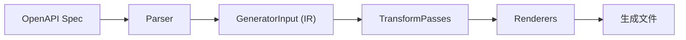

# TransformPass 插件扩展机制

状态：Active
日期：2026-02-27
适用仓库：`frontend_tk_rs`

---

## 1. 概述

TransformPass 是 `swagger_gen` 代码生成管道中的核心扩展点，允许在 OpenAPI IR（中间表示）生成后、渲染前对数据进行变换处理。

本文档描述如何使用 TransformPass 插件机制来自定义代码生成行为，以 `query/mutation` 分类为例。

---

## 2. 架构设计

### 2.1 管道流程



### 2.2 TransformPass Trait

```rust
pub trait TransformPass {
    fn name(&self) -> &'static str;
    fn apply(&self, input: &mut GeneratorInput) -> Result<(), String>;
}
```

### 2.3 内置 Pass 执行顺序

| 顺序 | Pass | 职责 |
|------|------|------|
| 1 | `NormalizeEndpointPass` | 基本归一化：排序、namespace 默认值、验证 |
| 2 | `DefaultQueryMutationPass` | 默认分类：GET → Query，其他 → Mutation |
| N | 自定义 Pass | 覆盖或扩展默认行为 |

**关键设计**：后执行的 Pass 可以覆盖前面 Pass 的结果。

---

## 3. 使用方式

### 3.1 添加自定义 Pass

```rust
use swagger_gen::pipeline::{CodegenPipeline, TransformPass, GeneratorInput};

// 1. 定义自定义 Pass
struct MyCustomPass;

impl TransformPass for MyCustomPass {
    fn name(&self) -> &'static str {
        "my-custom"
    }

    fn apply(&self, input: &mut GeneratorInput) -> Result<(), String> {
        for endpoint in &mut input.endpoints {
            // 自定义逻辑
        }
        Ok(())
    }
}

// 2. 注入到 pipeline
let pipeline = CodegenPipeline::default()
    .with_transform(Box::new(MyCustomPass))  // 添加自定义 Pass
    .with_renderer(Box::new(MyRenderer))
    .with_writer(Box::new(FileSystemWriter::new(output)));
```

### 3.2 API 参考

```rust
impl CodegenPipeline {
    /// 添加自定义 TransformPass
    /// Pass 按添加顺序执行，后添加的可以覆盖前面的结果
    pub fn with_transform(mut self, pass: Box<dyn TransformPass>) -> Self {
        self.transforms.push(pass);
        self
    }
}
```

---

## 4. 实战案例：Query/Mutation 分类

### 4.1 问题背景

某些 API 因为 GET 请求 URL 长度限制，使用 POST 方法来获取列表数据（如 `GetList`、`GetTree`）。这类接口语义上是查询操作，应该生成 React Query 的 Query 而非 Mutation。

### 4.2 解决方案

在 `swagger_gen_aptx` 中实现 `AptxQueryMutationPass`，通过 API 命名约定识别语义上的查询操作。

### 4.3 分类规则

```
┌─────────────────────────────────────────────────────────────┐
│  Query (supports_query = true)                              │
│  ├── GET 请求                                               │
│  └── POST 请求 + 匹配命名模式：                              │
│      ├── getXxx      (getList, getTree, getUser)           │
│      ├── queryXxx    (queryUsers, queryByFilter)           │
│      ├── searchXxx   (searchItems, searchByKeyword)        │
│      ├── fetchXxx    (fetchData, fetchRecords)             │
│      ├── findXxx     (findByCondition, findResults)        │
│      └── listXxx     (listUsers, listAll)                  │
├─────────────────────────────────────────────────────────────┤
│  Mutation (supports_mutation = true)                        │
│  └── 其他所有请求                                           │
│      (createUser, updateUser, deleteUser, submit, etc.)    │
└─────────────────────────────────────────────────────────────┘
```

### 4.4 代码实现

**文件**：`crates/swagger_gen_aptx/src/classifier.rs`

```rust
pub struct AptxQueryMutationPass;

impl TransformPass for AptxQueryMutationPass {
    fn name(&self) -> &'static str {
        "aptx-query-mutation"
    }

    fn apply(&self, input: &mut GeneratorInput) -> Result<(), String> {
        for endpoint in &mut input.endpoints {
            let is_query = classify_endpoint(endpoint);
            endpoint.supports_query = is_query;
            endpoint.supports_mutation = !is_query;
        }
        Ok(())
    }
}

fn classify_endpoint(endpoint: &EndpointItem) -> bool {
    // GET is always a query
    if endpoint.method.eq_ignore_ascii_case("GET") {
        return true;
    }

    // POST with query-semantic name
    if endpoint.method.eq_ignore_ascii_case("POST")
        && is_query_semantic_name(&endpoint.export_name)
    {
        return true;
    }

    false
}

fn is_query_semantic_name(name: &str) -> bool {
    let query_prefixes = ["get", "query", "search", "fetch", "find", "list"];

    for prefix in query_prefixes {
        if let Some(rest) = name.strip_prefix(prefix) {
            // camelCase: prefix + uppercase letter
            if !rest.is_empty()
                && rest.chars().next().is_some_and(|c| c.is_uppercase())
            {
                return true;
            }
        }
    }
    false
}
```

### 4.5 使用方式

**文件**：`crates/node_binding/src/built_in/aptx_commands.rs`

```rust
use swagger_gen_aptx::{AptxQueryMutationPass, AptxReactQueryRenderer};

let pipeline = CodegenPipeline::default()
    .with_transform(Box::new(AptxQueryMutationPass))  // 覆盖默认分类
    .with_client_import(client_import)
    .with_renderer(Box::new(AptxReactQueryRenderer))
    .with_writer(Box::new(FileSystemWriter::new(output)));
```

---

## 5. 扩展指南

### 5.1 修改 aptx 分类规则

编辑 `crates/swagger_gen_aptx/src/classifier.rs`：

```rust
fn is_query_semantic_name(name: &str) -> bool {
    // 添加新的前缀模式
    let query_prefixes = [
        "get", "query", "search", "fetch", "find", "list",
        "load",    // 新增: loadXxx
        "read",    // 新增: readXxx
    ];
    // ...
}
```

### 5.2 创建全新的分类器

```rust
// 1. 定义新 Pass
pub struct MyClassifierPass;

impl TransformPass for MyClassifierPass {
    fn name(&self) -> &'static str { "my-classifier" }

    fn apply(&self, input: &mut GeneratorInput) -> Result<(), String> {
        // 基于 OpenAPI extension、tag、或其他元数据判断
        for endpoint in &mut input.endpoints {
            // 自定义分类逻辑
        }
        Ok(())
    }
}

// 2. 在 pipeline 中使用
let pipeline = CodegenPipeline::default()
    .with_transform(Box::new(MyClassifierPass))
    // ...
```

### 5.3 基于配置的分类

可以通过扩展 `GeneratorInput` 或 `EndpointItem` 来支持配置驱动的分类：

```rust
// 未来可扩展：从 OpenAPI extension 读取分类配置
fn classify_from_extension(endpoint: &EndpointItem) -> Option<bool> {
    // 读取 x-query-mutation: "query" 等 extension
}
```

---

## 6. 文件结构

```
crates/
├── swagger_gen/
│   └── src/pipeline/
│       ├── transform.rs      # TransformPass trait + 内置 Pass
│       └── orchestrator.rs   # CodegenPipeline + with_transform
│
├── swagger_gen_aptx/
│   ├── src/
│   │   ├── lib.rs           # 导出 AptxQueryMutationPass
│   │   └── classifier.rs    # aptx 特定的分类实现
│   └── Cargo.toml
│
└── node_binding/
    └── src/built_in/
        ├── aptx_commands.rs      # 注入 AptxQueryMutationPass
        └── terminal_codegen.rs   # 注入 AptxQueryMutationPass
```

---

## 7. 设计原则

1. **开闭原则**：底层代码对修改关闭，对扩展开放
2. **职责分离**：每个 Pass 只做一件事
3. **可组合性**：多个 Pass 可以组合使用
4. **可覆盖性**：后执行的 Pass 可以覆盖前面的结果

---

## 8. 相关文档

- [ARCHITECTURE.md](./ARCHITECTURE.md) - 整体架构
- [codegen-guide.md](./codegen-guide.md) - 代码生成指南
